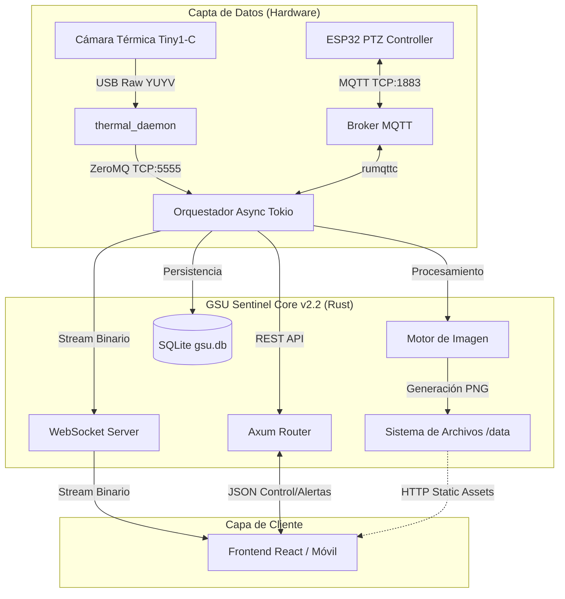
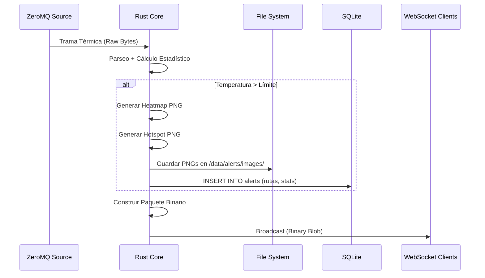

# Documentación Técnica: GCU Sentinel Core

**GCU Sentinel Core** es el backend de alto rendimiento desarrollado en **Rust** para el sistema de monitoreo térmico de aerogeneradores. Actúa como un orquestador central que ingiere datos crudos, procesa imágenes térmicas, gestiona la persistencia de alertas y sirve datos en tiempo real a clientes conectados.

---

## 1. Arquitectura del Sistema

El sistema sigue una arquitectura de **Microservicios en el Borde (Edge Computing)**, diseñada para baja latencia y alta concurrencia.

### Diagrama de Componentes



---

## 2. Flujo de Funcionamiento

### Ciclo de Vida de los Datos
1.  **Ingestión:** El sistema se suscribe al tópico de ZeroMQ. Recibe ~25 tramas por segundo conteniendo la matriz térmica cruda (Float32).
2.  **Identificación Contextual:** Paralelamente, escucha el tópico MQTT `gsu/data/status` para saber si la cámara apunta al GSU 1 (Izquierda) o GSU 2 (Derecha).
3.  **Análisis:**
    *   Calcula temperaturas Máxima, Mínima y Promedio.
    *   Compara la Máxima con el umbral definido en `config.toml`.
4.  **Gestión de Alertas:**
    *   Si se supera el umbral, verifica el *cooldown* (tiempo de espera) para no saturar.
    *   Genera dos imágenes PNG: Mapa de calor completo y Mapa de puntos calientes.
    *   Guarda el evento en SQLite y los archivos en disco.
5.  **Streaming:** Empaqueta los datos en un protocolo binario personalizado y los envía por WebSocket a todos los clientes.

### Diagrama de Secuencia: Detección de Alerta



---

## 3. Análisis del Código Fuente (`main.rs`)

La aplicación utiliza el runtime **Tokio** para manejar múltiples tareas asíncronas simultáneamente.

### 3.1. Gestión de Estado (`AppState`)
El estado se comparte entre hilos usando `Arc<Mutex<T>>`, garantizando seguridad en memoria.

```rust
struct AppState {
    // Configuración cargada desde TOML
    config: Config,
    // Identificador del GSU actual (Actualizado por MQTT)
    current_gsu: Arc<Mutex<u8>>,
    // Cliente MQTT para enviar comandos PTZ
    mqtt_client: AsyncClient,
    // Control de Cooldown para notificaciones
    last_notifications: Arc<Mutex<HashMap<u8, Instant>>>,
    // Canal de difusión para el video en vivo
    tx_binary_stream: broadcast::Sender<Vec<u8>>,
    // Pool de conexiones a Base de Datos
    db_pool: Pool<Sqlite>,
    // Monitoreo de Salud
    start_time: Instant,
}
```

### 3.2. Procesamiento de Imágenes
Se implementaron dos funciones clave para la generación de evidencia visual:

*   **`generate_complete_heatmap`:** Normaliza la matriz de temperaturas y aplica una paleta de colores (Azul -> Verde -> Rojo) para generar una imagen comprensible por humanos.
*   **`generate_hotspot_visual`:** Resalta exclusivamente los píxeles que superan el umbral de temperatura en rojo puro, dejando el resto en escala de grises. Ideal para diagnósticos rápidos.

### 3.3. Endpoints de la API (Axum)

La versión 2.2 introduce endpoints de mantenimiento y limpieza.

| Endpoint | Método | Descripción | Función Handler |
| :--- | :--- | :--- | :--- |
| `/ws` | `GET` | WebSocket Upgrade. Envía stream binario. | `ws_handler` |
| `/api/control` | `POST` | Control manual de la cámara (MQTT). | `control_handler` |
| `/api/health` | `GET` | Estado de servicios y Uptime. | `health_handler` |
| `/api/alerts` | `GET` | Lista las últimas 50 alertas. | `get_alerts_handler` |
| `/api/alerts` | `DELETE` | **Nuevo:** Borra DB y limpia carpetas de imágenes. | `delete_all_alerts_handler` |
| `/api/alerts/:id` | `DELETE` | **Nuevo:** Borra una alerta específica y sus fotos. | `delete_alert_handler` |
| `/data` | `GET` | **Nuevo:** Servidor estático para acceder a imágenes. | `ServeDir` |

### 3.4. Inicialización Robusta
El sistema ahora asegura que el entorno sea válido antes de arrancar:

```rust
// Creación automática de directorios de almacenamiento
fs::create_dir_all("data/alerts/images/complete")?;
fs::create_dir_all("data/alerts/images/puntos_calientes")?;

// Creación automática de la Base de Datos si no existe
let db_options = SqliteConnectOptions::from_str(&config.network.db_url)?
    .create_if_missing(true);
```

---

## 4. Protocolo Binario de Streaming

Para optimizar el ancho de banda en redes móviles, el streaming no usa JSON. Usa una estructura de bytes **Little Endian**.

| Byte Offset | Tipo | Descripción |
| :--- | :--- | :--- |
| 0 | `u8` | **Magic Byte (0xAF)**: Validación de trama. |
| 1 | `u8` | **GSU ID**: 1 (Izq), 2 (Der). |
| 2-9 | `u64` | **Timestamp**: Epoch ms. |
| 10-13 | `f32` | **Temp Max**: Valor flotante. |
| 14-17 | `f32` | **Temp Avg**: Valor flotante. |
| 18-21 | `u32` | **Payload Len**: Tamaño de la matriz. |
| 22... | `[f32]` | **Payload**: Matriz térmica cruda. |

---

## 5. Guía de Compilación y Ejecución

### Requisitos
*   Rust (Cargo).
*   Librerías del sistema: `libzmq3-dev` (Debian/Ubuntu) o `zeromq` (macOS).

### Paso 1: Configuración
Crea el archivo `config.toml` en la raíz del proyecto:

```toml
[turbine]
park_id = 15
turbine_number = 104
model = "Vestas V90"
type = "Onshore"

[limits]
max_temp_warning = 75.0
notification_cooldown_min = 30

[network]
zmq_endpoint = "tcp://127.0.0.1:5555"
mqtt_broker = "127.0.0.1"
mqtt_port = 1883
http_port = 3000
db_url = "sqlite://gsu.db"
```

### Paso 2: Compilación para Producción
El flag `--release` activa optimizaciones cruciales para el procesamiento de imágenes a 25FPS.

```bash
cargo build --release
```

### Paso 3: Ejecución
El ejecutable buscará `config.toml` y creará la base de datos automáticamente.

```bash
./target/release/gsu_sentinel_core_v2
```

**Salida esperada:**
```text
🟢 GSU Core v2.2 (Full) corriendo en puerto 3000
🔥 Escuchando thermal_daemon en tcp://127.0.0.1:5555
```

---

## 6. Mantenimiento y Limpieza

Gracias a los nuevos endpoints, el mantenimiento se puede realizar remotamente desde el Frontend React:

1.  **Limpieza Total:** Al invocar `DELETE /api/alerts`, el sistema:
    *   Ejecuta `DELETE FROM alerts`.
    *   Borra recursivamente las carpetas en `data/alerts/images/`.
    *   Recrea las carpetas vacías inmediatamente.
2.  **Health Check:** Consultar `/api/health` devuelve el estado de los servicios externos:
    ```json
    {
      "mqtt_status": "online",
      "zeromq_status": "online",
      "uptime_seconds": 3600,
      "timestamp": "2023-11-24T10:00:00Z"
    }
    ```
